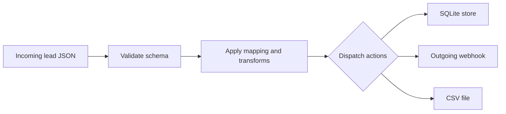

# flowbridge

flowbridge is a lightweight automation bridge between your tools. It exposes a FastAPI webhook that receives an event (for example a new lead as JSON), validates it against a schema, applies configurable transform and mapping rules defined in a YAML config, and dispatches the result to one or more pluggable actions: a local SQLite store, an outgoing webhook (Slack or Discord style), and a CSV file. The point is simple: connect tools through an API and let the data move on its own.

## Features

- FastAPI webhook endpoint (`POST /webhook`) with automatic schema validation via Pydantic.
- Configurable field mapping and transforms (lowercase, strip, title, default values) loaded from `config.yaml`.
- Pluggable action design: every action implements a small interface and is selected by name from config.
- Built-in actions: append to SQLite, POST to an outgoing webhook, append a row to CSV.
- Graceful per-action error handling so one failing action does not block the others.
- Runnable end-to-end demo that processes a sample lead with no server and no network needed.
- Secrets only via environment variables, with a `.env.example`.

## Tech

Python 3.10+, FastAPI, Pydantic, PyYAML, httpx, SQLite (standard library), Uvicorn.

## Setup

```bash
python -m venv .venv
source .venv/bin/activate      # on Windows: .venv\Scripts\activate
pip install -r requirements.txt
cp .env.example .env           # optional, only needed for the outgoing webhook action
```

## Run the end-to-end demo

This processes `sample_lead.json` through the full pipeline (validate, transform, dispatch) without starting a server:

```bash
python -m flowbridge.demo
```

After it runs you will have a `flowbridge.db` SQLite file and a `leads.csv` file containing the processed lead. The outgoing webhook action is skipped with a clear message if `OUTGOING_WEBHOOK_URL` is not set.

## Run the API server

```bash
uvicorn flowbridge.app:app --reload
```

Then send a lead:

```bash
curl -X POST http://127.0.0.1:8000/webhook \
  -H "Content-Type: application/json" \
  -d @sample_lead.json
```

The response reports which actions ran and their status. Visit `http://127.0.0.1:8000/docs` for the interactive API docs.

## Configuration

Edit `config.yaml` to change the field mapping, the transforms applied to each field, and which actions run. Each action entry has a `type` (matching a registered action) and its own options.

## How it works



Built by José Pedro Silva, marjers.com
